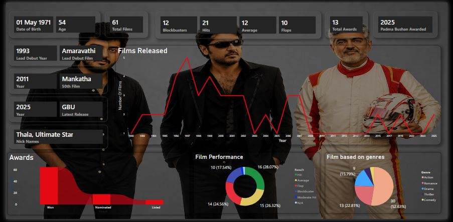

# 🎬 Actor Career Analysis Dashboard

## 📌 Project Overview
This project analyzes the career journey of an actor using a structured dataset of films, performance metrics, and achievements.  
The dashboard provides insights into film trends, genre distribution, and overall career performance.

---

## 🛠 Tools & Technologies
- Power BI  
- Power Query  
- DAX  
- Excel (Dataset)

---

## 📊 Key KPIs
- Debut Movie  
- Latest Release  
- Total Films  
- Film Performance Breakdown  
- Films Released by Year  

---

## 📈 Key Insights
- The actor has maintained a **balanced distribution of blockbuster, hit, and flop films**, indicating a dynamic career trajectory.  
- A significant portion of films belong to the **action genre**, showing strong genre preference.  
- Film releases show variation across years, highlighting **phases of high and low activity**.  

---

## 🖼 Dashboard Preview

---

## 💡 Notes
> *This project is created using publicly available/sample data for learning and portfolio purposes.*
